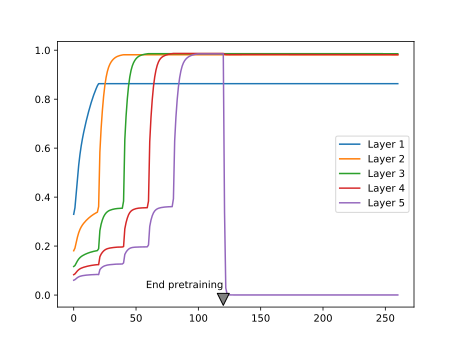

# Saturation analysis

This repository contains my implementation on the following paper:

> Glorot, X. and Bengio, Y. (2010). Understanding the difficulty of training deep feedforward neural networks. Proceedings of the Thirteenth International Conference on Artificial Intelligence and Statistics, pages 249-256.

# Overview
The work discusses the incapability of certain activation functions to work on deep neural networks under the prevailing initialization technique. As the number of layers increase, a problem known as saturation arises.

Saturation is seen in bounded activation functions, as the weights in certain layers of network push all the activation values (i.e. the output of the activation functions) towards its bounded extremities. Since all the outputs in a certain layer are located in plateaus, it is challenging to distinguish observations, thus learning hardly takes place.

    
     
    The saturation regions of the sigmoid (left) and its derivative (right)

Saturation in activation functions such as the sigmoid and the hyperbolic tangent also present another predicament in gradient-based learning. Since the aforementioned functions have symmetric derivatives around zero, as the observations migrate to the functions' extremes, their corresponding values in the derivative of activation function tend to zero. This in turn makes it harder for the system to steer towards optimal solutions as the parameter updates get smaller.

Traditionally, the weights of neural networks were initialized according to a technique popularized by Lecun (1998), which consists of sampling the weights from a bounded uniform distribution,

  ,

parametrized by <b>n</b>, the number of incoming connections to the linked node.

However, in settings with a great number of layers, saturation often took place. In 2006, a research direction brought forward by [Hinton et. al (2006)](https://www.mitpressjournals.org/doi/10.1162/neco.2006.18.7.1527), allowed for the training of deep neural networks using unsupervised pretraining, which yielded starting points that prevented this issue.
 
Glorot and Bengio claim that good starting points as the ones generated by pretraining could be emulated by common initialization techniques. This was laid on top of an assumption: to maintain the variance of activation values and their gradients. By creating an initialization technique with these properties, the authors would precisely tackle saturation, as very small variances are seen in saturated activation values and their gradients. With these assumptions, the authors reach the following initialization technique:

  ,

where the <b>n</b> are the number of incoming (<i>j</i>) and outgoing (<i>j+1</i>) connections. This initialization technique is often referred as the Xavier initialization. In the following sections, we are going to analyze the performance of this and other initialization techniques under several configurations.

# Experiments
The following results were obtained by training 5-hidden layer networks with 1000 neurons each, trained over the CIFAR-10 dataset. The density estimations are activation values of 300 observations of the test set. Here are some of the results: <!-- I guess either "Here are some of the results:" or "Below are some of the results." -->

<!-- it would be nice to have labels on the x-axes ;) -->
<table style="width:100%">
  <tr>
    <th>Initialization</th>
    <th colspan="2">Activation function</th>
  </tr>
  <tr>
    <th></th>
    <td>Sigmoid</td>
    <td>Hyperbolic tangent</td>
  </tr>
  <tr>
    <td><a href="http://yann.lecun.com/exdb/publis/pdf/lecun-98b.pdf">LeCun (1998)</a></td>
    <td></td>
    <td></td>
  </tr>
  <tr>
    <td><a href="http://proceedings.mlr.press/v9/glorot10a/glorot10a.pdf">Glorot and Bengio (2010)</a></td>
    <td></td>
    <td></td>
  </tr>
</table>

First off, the different distributions between activation functions can be explained by their different scale, as the sigmoid has a (0,1) range and the tanh (-1,1). As we can observe, regardless of the method of initialization employed, the activation values of the fifth hidden layer in the sigmoid spike around zero. These results are in accordance with the ones shown in the paper.

The authors indicate that this abrupt shift can perhaps be explained by an attempt of the system to suppress the meaningless information fed by the previous layers, thus basically relying on its bias to make the classification. With this result, the authors show the unsuitability of the sigmoid in deep networks.

However, the results of the hyperbolic tangent function have shown to deviate from the original findings. Despite similar results in the baseline initialization ([LeCun (1998)](http://yann.lecun.com/exdb/publis/pdf/lecun-98b.pdf)), these drastically differ in face of the initialization method proposed by the authors. The technique that allegedly inhibits saturation actually made it occur slightly faster.

    
     
    Activation values of the hyperbolic tangent during initialization using <a href="http://yann.lecun.com/exdb/publis/pdf/lecun-98b.pdf">Lecun (1998)</a> (top) and the proposed technique (below). Source: <a href="http://proceedings.mlr.press/v9/glorot10a/glorot10a.pdf">Glorot and Bengio (2010)</a>

Furthermore, contrasting with the original work, the replicated activation values using the CIFAR-10 dataset have not shown any qualitative differences between the then go-to and the proposed initialization.

    
    
    Activation values across two different initialization techniques: Lecun (1998) on the left and Glorot and Bengio (2010) on the right
      

# Additional experiments
## Unsupervised pretraining
Besides the aforementioned techniques, the same analysis was performed on a network trained using unsupervised pretraining. Different from the Restricted Boltzmann Machine proposed by Hinton, we use a Denoising Autoencoder ([Vincent et al. (2008)](https://www.cs.toronto.edu/~larocheh/publications/icml-2008-denoising-autoencoders.pdf)) to train each layer of the network for 100 epochs before the gradient-based stage.

    
    
     
    Activation values using unsupervised pretraining: sigmoid on the left and tanh on the right.

Here we notice that the early stages of training slowly push the activation values towards the extremities. Despite not having a great effect on the sigmoid, which after the process demonstrated a similar behavior, the unsupervised pretraining caused a great change in the hyperbolic tangent setting. Instead of continuing to spike around the extremities, the last layer of the network has settled in zero, a quite unstable point for the activation function. We conjecture that this behavior can be explained as the authors have done for the sigmoid: The high peak in the last layer on zero is an attempt to suppress useless information from previous layers. <!-- see https://www.grammarly.com/blog/capitalization-after-colons/ -->

## Dynamic variance comparison
In order to verify if the assumptions made by authors would hold during training, we compared the variance of the activation values across three different cases using the hyperbolic tangent:

    
    
    
    Variance of activation values across three different initialization techniques. From left to right: <a href="http://yann.lecun.com/exdb/publis/pdf/lecun-98b.pdf">LeCun (1998)</a>, <a href="http://proceedings.mlr.press/v9/glorot10a/glorot10a.pdf">Glorot and Bengio (2010)</a> and <a href="https://www.cs.toronto.edu/~larocheh/publications/icml-2008-denoising-autoencoders.pdf">Vincent et al. (2008)</a>

Here we noticed that the first and second results do not vary greatly. This by itself does not mean that the assumptions do not hold. However, when analyzing the behavior of the curves, we notice the abrupt growth in the early stages of training, which is later bounded by the function range. Despite "stabilizing" in later stages of training, this more likely has to do with the restrictions of the activation function, rather than the well-behaved, expected, performance.

Furthermore, a similar result can be seen in the pretraining stage, only slower. The surges seen can be justified by the sampling procedure adopted during the pretraining phase, executed every 5 epochs, instead of every epoch as in gradient-based training. As mentioned in the last section and different from the other settings, here we can also notice the null-gradient in the last layer of the network.

# Conclusion
Finally, in qualitative terms, no configuration was immune to saturation and the discrepancies here showed may have potential reasons. The main dataset used by the authors was a syntactic Shapeset-3x2, while most of our analyses were performed by using the CIFAR-10 dataset. However, note that some of these analyses were also extended to the MNIST dataset, as suggested by the authors. Yet, they have yielded similar results like the ones here shown.

---
More details on the historical perspective of saturation, as well as an overview of unsupervised pretraining, can be seen [here](https://artur-deluca.github.io/post/pretraining/)

# Code: How to use it
1. Install the requirements
2. Run `train.py --help` to check the parameters
3. Have fun!

---

P.S.
1. There are more scripts than the above, but these are supplementary. Feel free to use them as well.
2. The activation plots slightly extrapolate the precise output limits. That doesn't invalidate the conclusions rather hurts the shape of the estimated distributions.
---
